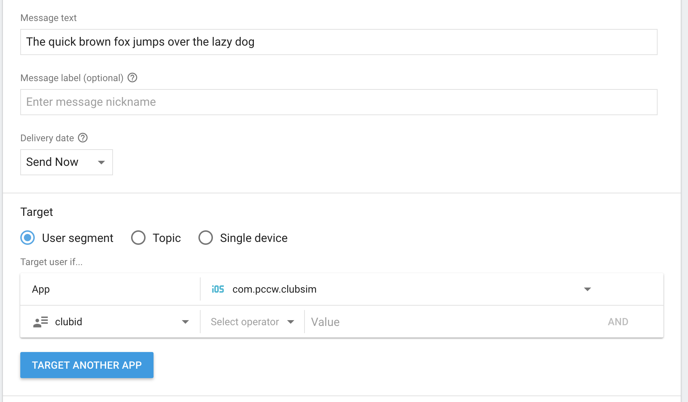

# Firebase Guide
(last updated by: Kev Lai, Jan 29, 2017)

## Login
### Step 1: Home Page
Go to the console through this link: https://firebase.google.com/

  

Home Page

### Step 2: Sign In
Click the  `Sign In` button at the top right corner and input the following credentials:

- username: clubsim.hk@gmail.com
- password: Ab20120130

  

Sign In Page

### Step 3: Home Page (Signed In)
If login is sucessful, you should be redirected back to the same page. Click the `GO TO CONSOLE` button at the top right hand corner.

  

Home Page

### Step 4: Console Page
You should be directed to their console, where you should see there's a project called `ClubSIM` with project ID `clubsim-d63ed`. Click on it.

  

Console Page

### Step 5: Project Overview Page
If everything checks out, you will make it to the `project overview page` of the ClubSIM project.

  

Projects Page

## Send Message
In order to send a message to a ClubSIM user, you have to
- send a Chinese message and a English through Firebase's iOS Notification Service
- send a Chinese message and a English through Firebase's Android Notification Service

Basically, you have to send four messages. The reason behind is mainly because you can't tell the user's language preference and they may hold devices on both Android and iOS platforms.

For starters, scroll to the bottom of the side menu, aka the navigation drawer. You should be able to see the option `Notifications`.

  

Side menu

Click on it and you should see a page similar to this:

  

Notification Page

For the subsequent sections, I'll be using the following scenario as demostration purpose:

Sending the following messages to a ClubSIM user with ID `1234567`
- Chinese: 那隻敏捷的棕毛狐狸躍過那隻懶狗
- English: The quick brown fox jumps over the lazy dog

### iOS
#### Step 1: Compose Message Page
First of all, click the blue button that says `NEW MESSAGE`.

  

New Message Button

And you should be directed to the `Compose Message Page`.

  

Compose Message Page

#### Step 2: Message Text
Naturally, input what you want to send on the `Message text` field:

  

English Text

#### Step 3: Segment: App
This is where things may get a little bit tricky. Check out the `Target` section. For now, you can see there's a drop down list called `Select app`. Click on it and choose the option that says `com.pccw.clubsim` with the iOS logo next to it.

  

iOS

  

iOS

#### Step 4: Segment: Club ID
See the word `AND` next to `com.pccw.clubsim` over there? Click on it, and you should see another row show up.

  

Row

Then click on the `Select...` dropdown list and hover to `User Property`, and a submenu should appear.

  

Club ID Option

Choose `clubid` and you should see your form now looks like this:

  

Club ID Option

Input the ID of the CLubSIM user onto the `Value` field.

  

Club ID Value

As for the `Select operator` dropdown list, click on it and choose `exact matches`.

  

Club ID Operator Dropdown

  

Club ID Operator: Exact matches

#### Step 5: Segment: Accept Push
Now you can repeat Step 4, but instead of choosing `clubid`, choose `acceptpush`. And set the `Value` field to `yes`.

  

Accept Push

#### Step 6: Segment: Language
Repeat Step 4 again, but instead of choosing `clubid`, choose `language`. And set the `Value` field to `eng`, because you're sending an English message. And beware the `language` here is a custom user property, not the `Language` option Firebase offers as a default.

  

Language: English

#### Step 7: Send English Message
Now you can scroll down to the bottom, and click the `SEND MESSAGE` button at the bottom right corner. A dialog should appear.

  

Send English Message

Hit `SEND` and you should be directed back to the `Notification Page`, where you can check the status of the message sending process, which should show `Completed` if the message is sent.

  

Send Status

Note that `Completed` here only means message is successfully sent according to the previous criterias you've set. It doens't mean the message is guaranteed to have reached your target user's device(s), majorly on which how you configure the criterias (`acceptpush`, `language` and `clubid`).

#### Step 8: Send Chinese Message
Repeat step 1 - 7. But before you sent the message, make sure your configuration matches the following:

  

Language: Chinese

where the `language` value is changed to `chi`.

### Android
#### Step 1: Send English Message
Repeat step 1 - 7 of the iOS Section, but make sure your configuration matches the following:

  

Language: English

#### Step 2: Send Chinese Message
Same as Step 1, butmake sure your configuration matches the following:

  

Language: Chinese

where
- the `App` field is changed to `com.pccw.clubsim` with the Android logo next to it
- the `language` value is changed to `zh`, not `chi`
- the `acceptpush` value is changed to `true`, not `yes`.

### Summary
For referencing pusposes, here's a table summarizing what you should choose for different fields on each platform:

|               | Android       | iOS    |
| ------------- |:-------------:| ------:|
| acceptpush    | true/false    | yes/no |
| language      | zh/en         | chi/eng|
